# 🐔 Bird Counting & Weight Estimation System

[](https://python.org)
[](https://fastapi.tiangolo.com)
[](https://streamlit.io)
[](https://github.com/ultralytics/ultralytics)

A comprehensive Computer Vision system designed to detect, track, and estimate the weight of poultry from CCTV footage. Built with **YOLOv8**, **ByteTrack**, and a modern **FastAPI + Streamlit** stack.

---

## 🏗️ System Architecture

The system follows a modular microservices-like architecture, separating the heavy CV processing from the user interface.

```mermaid
graph TD
    User([👤 User]) <-->|Uploads Video / Views Results| UI[Streamlit Dashboard]
    UI <-->|HTTP POST /analyze_video| API[FastAPI Backend]
    
    subgraph "Core Engine (core/)"
        API -->|Trigger Analysis| VP[VideoProcessor]
        VP -->|Raw Frame| YOLO[🚀 YOLOv8 Detection]
        YOLO -->|BBox & Class| BT[🔄 ByteTrack Tracking]
        BT -->|Track IDs| Logic[⚖️ Weight & Count Logic]
    end
    
    Logic -->|Draws| Video[🎥 Processed Video]
    Logic -->|Aggregates| Data[📊 Time-Series Stats]
    
    Video -.->|Static File Serve| UI
    Data -.->|JSON Response| UI
```



## ✨ Key Features

- **🎯 Real-time Detection**: Utilizes `YOLOv8-Nano` (Fine-tuned) for high-speed bird detection.
- **🔄 Robust Tracking**: Integrated `ByteTrack` algorithm to maintain unique IDs across frames and handle occlusions.
- **⚖️ Weight Estimation Proxy**: Calculates a Relative Weight Index ($Width \times Height$) to monitor flock growth trends.
- **📊 Interactive Dashboard**:
    - Side-by-side video comparison (Original vs. Processed).
    - Real-time line charts for bird counts.
    - Data export capabilities.
- **🔌 RESTful API**: Fully documented FastAPI backend for integration with other systems.

## 🚀 Getting Started

### Prerequisites
- Python 3.8+
- CUDA-enabled GPU (Recommended for faster processing)

### Installation

1.  **Clone the Repository**
    ```bash
    git clone https://github.com/architpr/bird-counting-.git
    cd bird-counting-
    ```

2.  **Set up Environment**
    ```bash
    python -m venv venv
    # Windows
    .\venv\Scripts\activate
    # Mac/Linux
    source venv/bin/activate
    ```

3.  **Install Dependencies**
    ```bash
    pip install -r requirements.txt
    ```

## 🏃‍♂️ Usage

We provide a **one-click startup script** for Windows users.

### Option A: Quick Start (Windows)
Double-click `start_app.bat` or run:
```powershell
.\start_app.bat
```
*This will launch both the API (Port 8000) and the UI (Port 8501).*

### Option B: Manual Startup

**1. Start Backend API**
```bash
uvicorn api.main:app --reload --port 8000
```

**2. Start Frontend UI**
```bash
streamlit run ui/app.py
```

Access the dashboard at: [http://localhost:8501](http://localhost:8501)

## 🧠 Model & Fine-Tuning

The system uses a **YOLOv8n** model fine-tuned on the *Chickens Dataset* (TFRecord source).

| Metric | Value (Epoch 3) | Description |
| :--- | :--- | :--- |
| **Precision** | **0.37** | Accuracy of positive predictions. |
| **Recall** | **0.47** | Ability to find all positive instances. |
| **mAP@50** | **0.36** | Mean Average Precision at 0.5 IoU. |
| **F1 Score** | **0.42** | Harmonic mean of Precision and Recall. |

*Note: The system automatically loads the fine-tuned weights from `output/chicken_model/weights/best.pt` if available.*

## 🔌 API Reference

**POST** `/analyze_video`
- **Input**: `file` (Multipart/Form-Data, .mp4/.avi)
- **Output**: JSON containing processing stats and video URL.

**GET** `/health`
- Checks if the API is running.

## 📁 Directory Structure
```
├── api/          # FastAPI application
├── core/         # Computer Vision logic (Pipeline, Settings)
├── ui/           # Streamlit dashboard
├── data/         # Temp storage for uploads
├── output/       # Processed videos & Training runs
├── train_model.py # Fine-tuning script
└── convert_tfrecord.py # Dataset conversion tool
```

## 📜 License
Distributed under the MIT License. See `LICENSE` for more information.
